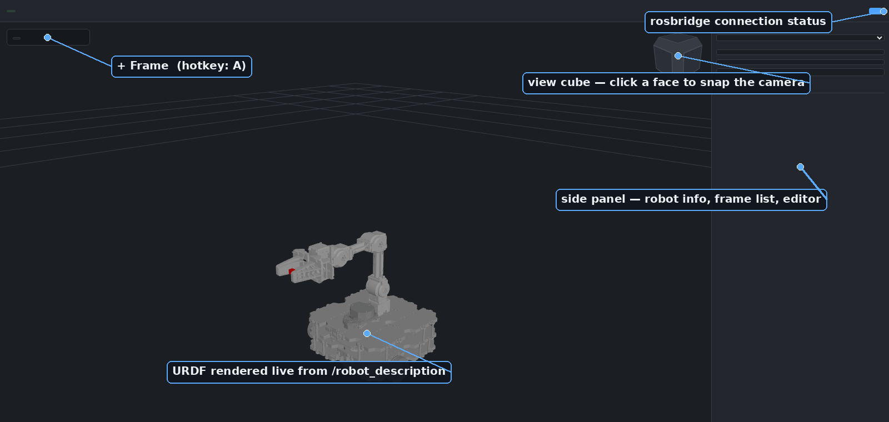
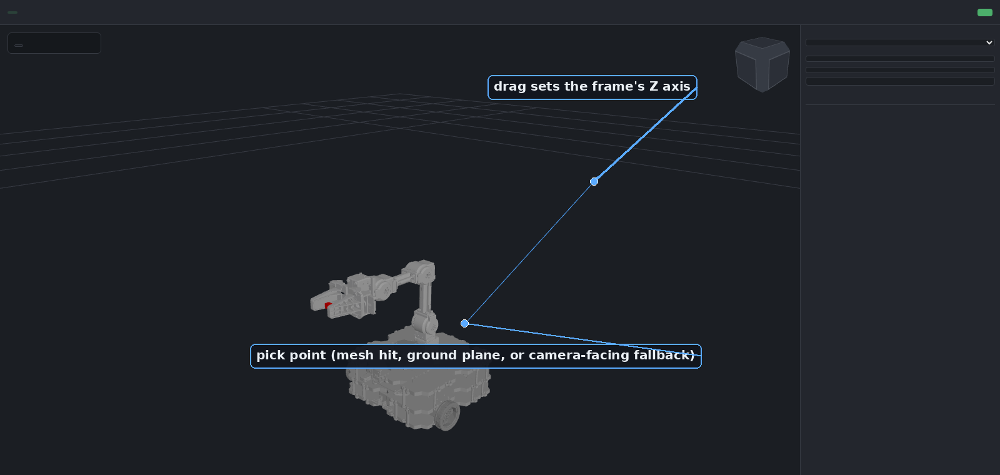
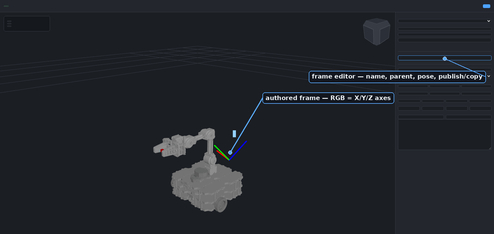
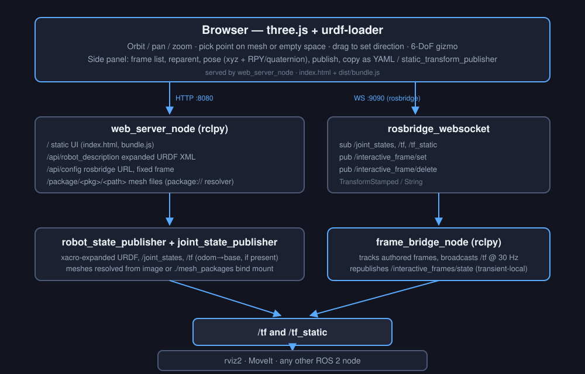

# web_tf_editor

A browser-based, rviz-like viewer for **ROS 2 Jazzy**. It renders a robot's URDF, lets you
orbit/pan/zoom the scene, and — unlike rviz — lets you **author 3D TF frames interactively**:
click a point on the robot (or in empty space), drag to set a direction, then refine with a
6-DoF gizmo. Authored frames are broadcast on `/tf` so rviz2, MoveIt, or any other ROS 2 node
can consume them immediately.

It's a normal ROS 2 Jazzy package (`colcon build` + `ros2 launch`). The UI is just a web page (no rviz plugin, no X11 forwarding, shareable with a link).



## Features

- **Live URDF viewer** — loads a robot's URDF/xacro (from a file path, a ROS topic, or the
  `robot_description` parameter), drives it from `/joint_states`, and places the root from `/tf`
  when an odom→base transform exists. Multiple robots and static scenes can be loaded side by
  side (each panel "Add robot" call adds a new instance instead of replacing the current one) —
  see [Multiple robots and scenes](#multiple-robots-and-scenes).
- **Interactive frame authoring** — click anywhere (mesh surface, ground plane, or a
  camera-facing plane as a fallback) and drag to set the new frame's Z axis, no typing
  coordinates by hand.
- **6-DoF gizmo** — translate/rotate handles (`T`/`R`) for precise placement once a frame exists.
- **Full frame editor** — rename, reparent (world pose is preserved across reparenting), edit
  position as XYZ *and* orientation as RPY/quaternion simultaneously (two-way synced), toggle
  visibility, publish/unpublish to `/tf`.
- **Copy-out for ROS** — export any frame as YAML or as a ready-to-run
  `ros2 run tf2_ros static_transform_publisher …` command.
- **rviz-style navigation** — orbit/pan/zoom plus a click-to-snap view cube.

## Screenshots

|                                          |                                              |
| ---------------------------------------- | -------------------------------------------- |
|  |  |
| Click a point and drag to set a direction — the new frame's Z axis follows the drag. | Every frame gets a full editor: reparent, pose, publish, copy out as YAML or a `static_transform_publisher` command. |

## Use cases

- **Sensor/tool extrinsics** — eyeball a camera, LiDAR, or gripper offset on the actual mesh
  instead of hand-editing numbers in a xacro file, then copy the result straight into a
  `static_transform_publisher` launch entry.
- **MoveIt goal frames** — author a grasp or approach frame relative to a link, publish it live,
  and drive planning against it without restarting anything.
- **Calibration sanity checks** — visually confirm a frame estimated by an external calibration
  pipeline lines up with the robot before trusting it downstream.
- **Teaching / demos** — a lightweight, browser-only way to show TF concepts (parent/child,
  world-pose-preserving reparenting) without installing rviz.
- **Remote / headless robots** — inspect and author frames on a robot with no display attached,
  from any machine on the network.

## Architecture



The browser talks to the ROS 2 graph over two channels: plain HTTP for the static UI, the
expanded URDF, and mesh files (`web_server_node`), and a rosbridge WebSocket for live topics.
Authored frames are sent to `frame_bridge_node`, which is the single source of truth for
`/tf` — it broadcasts all authored frames at 30 Hz and republishes them as a transient-local
state topic so a page reload restores them.

## Quick start

Requires a sourced ROS 2 Jazzy install on the host, plus this package's dependencies
(`rosbridge_server`, `robot_state_publisher`, `joint_state_publisher`, `xacro`, and, for the
default robot, `turtlebot3_manipulation_description`).

```bash
# clone (or symlink) this package into a colcon workspace
mkdir -p ~/ros2_ws/src
ln -s /path/to/interactive_frame_js ~/ros2_ws/src/web_tf_editor
cd ~/ros2_ws

# install missing ROS dependencies
rosdep install --from-paths src --ignore-src -r -y

# build (the pre-built front end in web/dist/ is committed, so no npm is needed here)
colcon build --symlink-install --packages-select web_tf_editor
source install/setup.bash

ros2 launch web_tf_editor web_tf_editor.launch.py
```

Then open **http://localhost:8080**. rosbridge listens on `ws://localhost:9090`. Both ports are
launch arguments (`http_port:=`, `ros_bridge_port:=`) if you need to avoid a clash with something
else already running on the host. The web server listens on all interfaces by default and serves
files from any installed package's share directory; pass `bind_address:=127.0.0.1` to keep it
local to the machine.

Default robot is TurtleBot3 + OpenMANIPULATOR-X. To use a different robot:

```bash
ros2 launch web_tf_editor web_tf_editor.launch.py urdf:=/path/to/robot.urdf.xacro
```

This also applies when loading a URDF from a ROS topic or the `robot_description` parameter via
the panel's "Add robot" controls, not just via `urdf:=`.

### Meshes

Whatever serves `package://` URIs needs the actual mesh files on disk — this is true for rviz
too. Because `web_server_node` runs natively on the host, it resolves `package://<pkg>/...`
through the host's own ROS 2 environment (`ament_index_python`), so any description package
already installed on the host — via `apt`, a workspace overlay, wherever — just works with no
extra steps. If a package isn't installed, the loader will still say "Loaded" (the URDF itself
parsed fine) but the robot will render with no visible geometry — check the browser
console/network tab for 404s on `/package/<pkg>/...` to confirm this is what's happening.

For mesh directories that aren't installed as proper ROS packages (e.g. dropped in ad hoc), pass
extra search directories via the `mesh_search_paths` launch argument (colon-separated), which
`web_server_node.py`'s `/package/<pkg>/<path>` route falls back to when a package isn't found
through `ament_index`:

```bash
ros2 launch web_tf_editor web_tf_editor.launch.py mesh_search_paths:=/path/to/extra_meshes
```

### Multiple robots and scenes

The panel's "Add robot" button adds a robot/scene instance alongside whatever is already
loaded — it doesn't replace it, so you can view e.g. a humanoid and a static factory scene
together, each with its own name/joint-count/status row in the sidebar (with a ✕ to remove
just that one). Each instance is positioned independently from `/tf`: an instance whose
`base_footprint`/`base_link` (or namespaced equivalent) is found in the TF tree follows it,
and one with no such frame — a static scene, typically — just sits at the fixed frame's
origin.

On the ROS side, each additional robot or scene needs its own `robot_description`/
`joint_states` publisher on a distinct namespace so they don't collide with each other or
the default robot — `docker/ur5e_description/launch/ur5e_description.launch.py` is a working
example (a `robot_state_publisher` + `joint_state_publisher` pair remapped onto
`/ur5e/robot_description` and `/ur5e/joint_states`). A static scene is the same pattern minus
`joint_state_publisher`, since it has no joints. Then in the panel: source "Topic", topic name
`/<namespace>/robot_description`, joint states topic `/<namespace>/joint_states` (auto-guessed
from the topic name), "Add robot".

## Using the UI

1. Click **+ Frame** (or press `A`) to enter add-frame mode.
2. Click a point — on the robot mesh, or in empty space (falls back to the ground plane, then a
   camera-facing plane) — and drag to set a direction; release to place the frame. The frame's Z
   axis is aligned to the drag direction by default.
3. Right-click a frame for a context menu: align X/Y/Z to the drag direction, show the 6-DoF
   gizmo, rename, or delete.
4. With the gizmo shown, `T`/`R` switch translate/rotate, `Esc` deselects.
5. Use the side panel to rename, reparent (world pose is preserved across reparenting), edit
   position/RPY/quaternion, publish/unpublish to `/tf`, delete, or copy the frame out as YAML or
   as a `ros2 run tf2_ros static_transform_publisher …` command.

## Development

Front-end iteration without a `colcon build` per change: point `web_server_node` straight at the
source tree's `web/` directory instead of the installed copy under `install/`, and rebuild only
the JS bundle.

```bash
cd web
npm install
npm run watch
```

```bash
ros2 launch web_tf_editor web_tf_editor.launch.py \
  web_root:=/path/to/interactive_frame_js/web
```

With `web_root` pointed at the source tree, `web_server_node` serves the freshly built
`dist/bundle.js` on the next page refresh — no relaunch needed.

`web/dist/` is committed because the ROS buildfarm builds release packages offline, without npm.
After changing anything under `web/src/`, run `npm run build` (minified, no sourcemap, and it
regenerates `dist/THIRD_PARTY_NOTICES.txt`) and commit `web/dist/` along with the source. CI
fails if the two are out of sync.

## Docker

`Dockerfile`/`docker-compose.yml` are kept for sandboxed testing (e.g. CI, or trying the UI on a
machine without ROS 2 installed) — not for real use. A container only sees the description
packages baked into its image or explicitly bind-mounted in, so `package://` mesh resolution
breaks for anything else already installed on the host; running natively (see Quick start above)
avoids that entirely.

## License

Apache License 2.0 — see [`LICENSE`](LICENSE). The bundled front end includes third-party
JavaScript under MIT, BSD-2-Clause and Apache-2.0 licenses (three.js, roslib, urdf-loader and
their dependencies) — see [`web/dist/THIRD_PARTY_NOTICES.txt`](web/dist/THIRD_PARTY_NOTICES.txt).
